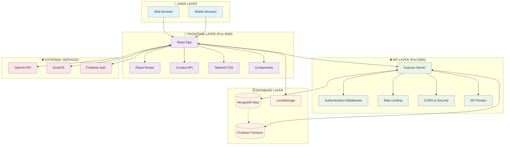
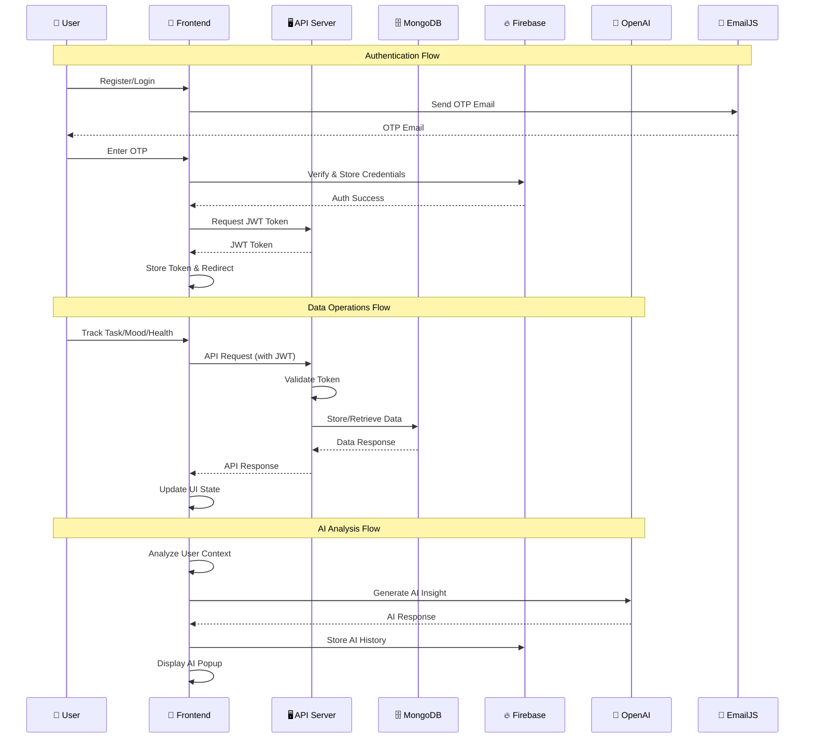
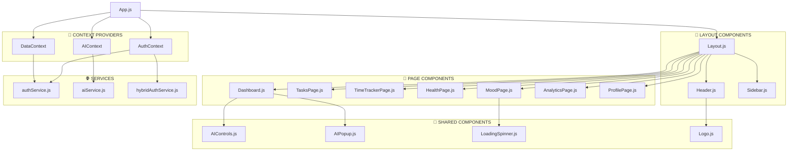
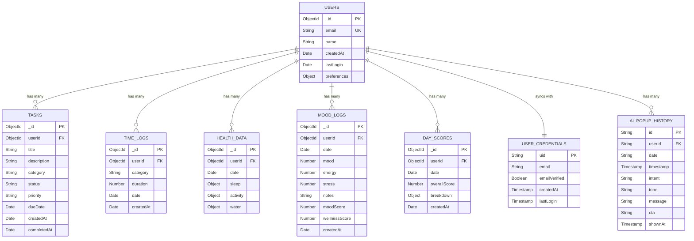
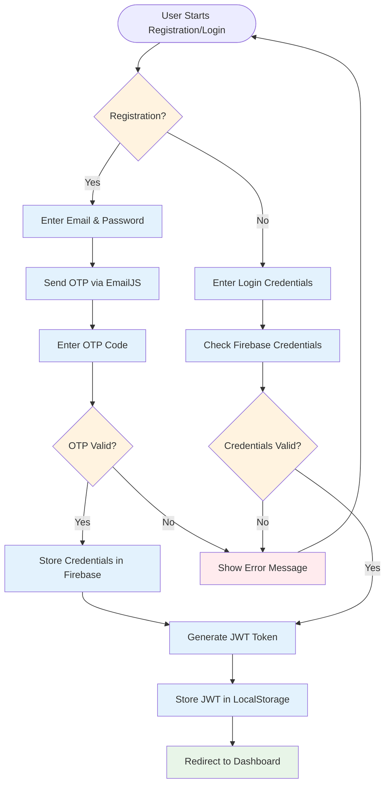
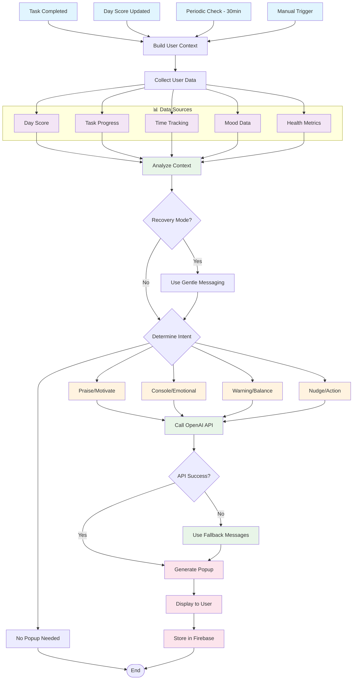
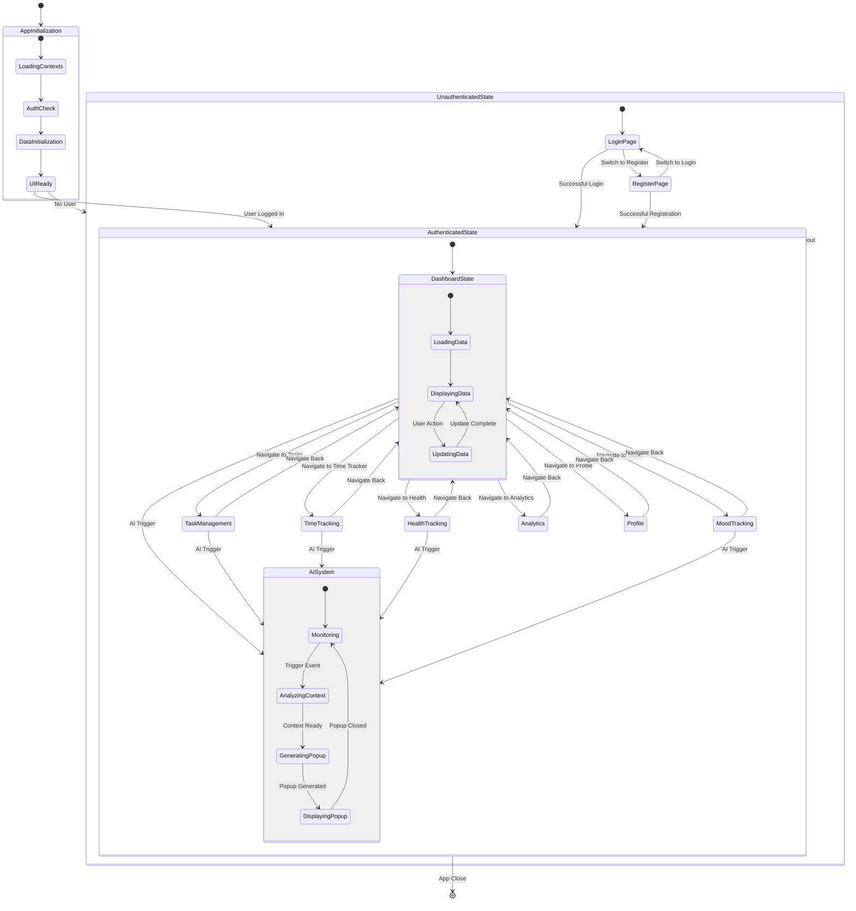
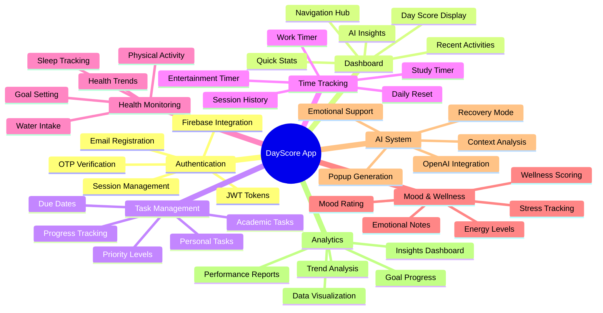
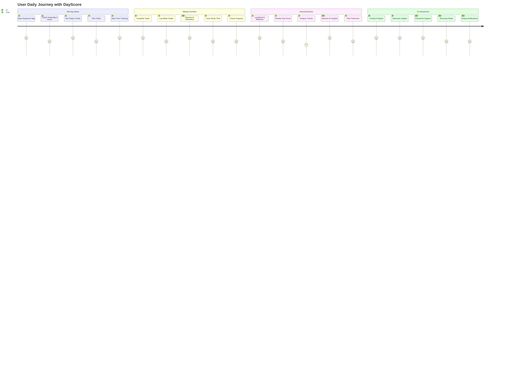

# 🔄 DayScore - Architecture Flowchart & Visual Diagrams

## 🏗️ **System Architecture Flowchart**



---

## 🔄 **Data Flow Diagram**



---

## 🏗️ **Component Architecture Diagram**



---

## 🗄️ **Database Schema Diagram**



---

## 🔐 **Authentication Flow Diagram**



---

## 🧠 **AI System Flow Diagram**



---

## 📊 **Day Score Calculation Flow**

```mermaid
flowchart TD
    START([Calculate Day Score])
    
    %% Data Collection
    subgraph "📊 Data Collection"
        PROD[Productivity Score - 25%]
        HEALTH[Health Score - 25%]
        FOCUS[Focus Score - 25%]
        WELLNESS[Wellness Score - 25%]
    end
    
    %% Productivity Calculation
    subgraph "⚡ Productivity Calculation"
        TASKS[Task Completion Rate]
        TIME[Time Tracking Efficiency]
        PROD_CALC[Calculate: 85%]
    end
    
    %% Health Calculation
    subgraph "🏥 Health Calculation"
        SLEEP[Sleep Duration & Quality]
        ACTIVITY[Physical Activity]
        WATER[Water Intake]
        HEALTH_CALC[Calculate: 78%]
    end
    
    %% Focus Calculation
    subgraph "🎯 Focus Calculation"
        SCREEN[Screen Time Balance]
        DISTRACTION[Distraction Levels]
        FOCUS_CALC[Calculate: 82%]
    end
    
    %% Wellness Calculation
    subgraph "😊 Wellness Calculation"
        MOOD[Mood Rating 1-5]
        ENERGY[Energy Level 1-10]
        STRESS[Stress Level 1-10]
        NOTES[Note Sentiment Analysis]
        WELLNESS_CALC[Calculate: Dynamic%]
    end
    
    %% Final Calculation
    COMBINE[Combine All Scores]
    FORMULA[Formula: (85×0.25) + (78×0.25) + (82×0.25) + (Wellness×0.25)]
    RESULT[Final Day Score: 80+]
    
    %% Store Result
    STORE[Store in Database]
    UPDATE_UI[Update Dashboard UI]
    
    %% Flow Connections
    START --> PROD
    START --> HEALTH
    START --> FOCUS
    START --> WELLNESS
    
    PROD --> TASKS
    PROD --> TIME
    TASKS --> PROD_CALC
    TIME --> PROD_CALC
    
    HEALTH --> SLEEP
    HEALTH --> ACTIVITY
    HEALTH --> WATER
    SLEEP --> HEALTH_CALC
    ACTIVITY --> HEALTH_CALC
    WATER --> HEALTH_CALC
    
    FOCUS --> SCREEN
    FOCUS --> DISTRACTION
    SCREEN --> FOCUS_CALC
    DISTRACTION --> FOCUS_CALC
    
    WELLNESS --> MOOD
    WELLNESS --> ENERGY
    WELLNESS --> STRESS
    WELLNESS --> NOTES
    MOOD --> WELLNESS_CALC
    ENERGY --> WELLNESS_CALC
    STRESS --> WELLNESS_CALC
    NOTES --> WELLNESS_CALC
    
    PROD_CALC --> COMBINE
    HEALTH_CALC --> COMBINE
    FOCUS_CALC --> COMBINE
    WELLNESS_CALC --> COMBINE
    
    COMBINE --> FORMULA
    FORMULA --> RESULT
    RESULT --> STORE
    STORE --> UPDATE_UI
    
    %% Styling
    classDef scoreClass fill:#e3f2fd
    classDef calcClass fill:#e8f5e8
    classDef resultClass fill:#fff3e0
    
    class PROD,HEALTH,FOCUS,WELLNESS scoreClass
    class PROD_CALC,HEALTH_CALC,FOCUS_CALC,WELLNESS_CALC calcClass
    class RESULT,STORE,UPDATE_UI resultClass
```

---

## 🔄 **State Management Flow**



---

## 🎯 **Feature Integration Map**



---

## 📱 **User Journey Flow**



---

*This comprehensive architecture documentation provides visual representations of the DayScore application's technical structure, data flows, and system interactions. Each diagram serves a specific purpose in understanding different aspects of the application architecture.*

---

**Legend:**
- 🔵 **Blue**: User Interface & Frontend
- 🟢 **Green**: Backend & API Services  
- 🟡 **Yellow**: Database & Storage
- 🟣 **Purple**: External Services & AI
- 🔴 **Red**: Error States & Security